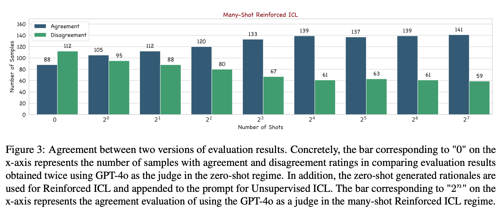
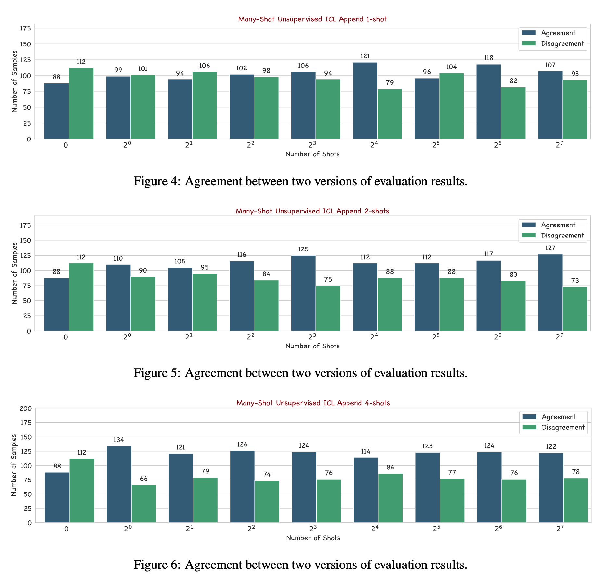

<div align="center">
  <h1>Can Many-Shot In-Context Learning Help Long-Context LLM Judges?<br>See More, Judge Better!</h1>
</div>

In this work, we propose and study two versions of many-shot in-context prompts, Reinforced and Unsupervised ICL, for helping GPT-4o-as-a-Judge in single answer grading. The former uses in-context examples with model-generated rationales, and the latter without. Based on the designed prompts, we investigate the impact of scaling the number of in-context examples on the agreement and quality of the evaluation. Furthermore, we first reveal the symbol bias in GPT-4o-as-a-Judge for pair-wise comparison and then propose a simple yet effective approach to mitigate it. Experimental results show that advanced long-context LLMs, such as GPT-4o, perform better in the many-shot regime than in the zero-shot regime. Meanwhile, the experimental results further verify the effectiveness of the symbol bias mitigation approach.
> Please find more details of this work in the [paper](https://arxiv.org/abs/2406.11629).

<p>

</p>

> Reinforced ICL for GPT-4o-as-a-Judge in Single Answer Grading

<p>

</p>

> Unsupervised ICL for GPT-4o-as-a-Judge in Single Answer Grading

## Cite
If you use this benchmark, please cite this paper
```
@misc{song2024manyshotincontextlearninghelp,
      title={Can Many-Shot In-Context Learning Help Long-Context LLM Judges? See More, Judge Better!}, 
      author={Mingyang Song and Mao Zheng and Xuan Luo},
      year={2024},
      eprint={2406.11629},
      archivePrefix={arXiv},
      primaryClass={cs.CL},
      url={https://arxiv.org/abs/2406.11629}, 
}
```

## CONTACT
For any questions, feel free to create an issue, and we will try our best to solve it. \
**If the problem is more urgent**, you can email me simultaneously (I check email almost daily).
```
NAME: Mingyang Song
EMAIL: nickmysong@tencent.com
```
